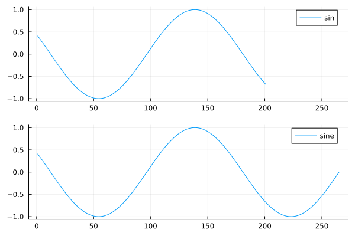

```@meta
CurrentModule = MusicalPlaying
```

# Sounds

A sound is a function and a duration it sould be played.
When playing a sound, the function is sampled to generate a sound of the required length.

We can get a sound, from a note through this path:

* Note + Tuning -> Tone
* Tone + Instrument -> Sound

So the Note encodes the abstract musical information about pich, duration and loudness.
The Tuning turns this into frequency.
The instrument describes how to actually render the tone: it is 
* a periodic function (tone generator)
* an envelope
* effects to apply before enforcing the envelope

The simples instrument is just a sine function, but with an envelope extending the playing to it reaches 0.

That instrument is caled `sine`.

``` julia
using MusicalPlaying
n1 = note("C")
t1 = tone(n1, tuning = tet12)
s1 = sound(t1, sine)
play_wav(s1)
```

Playing a short melody:

``` julia
using MusicalPlaying
m1 = Melody([note("C"), note("E"), note("G")])
s1 = sound(m1, sine)
play_wav(s1)
```

How does the samples look?

``` julia
using MusicalPlaying
n1 = note("A")
t1 = tone(n1, tuning = tet12)
s1 = sound(t1, sine)
s2 = MusicalPlaying.sample(s1)
plot(s2[1:100])
plot(s2[end-100:end])
length(s2) # 44201
s1.seconds # 1.0022727
```

I we use the simple `sin()` function it would not end at zero, but it respects the 1s tone length.

``` julia
julia> plot(plot(MusicalPlaying.sample_wav_direct(note("C"))[43900:end]), plot(MusicalPlaying.sample(sound(tone(note("C")),sine))[43900:end]), link=:both, layout=(2,1), label=["sin" "sine"])
```



