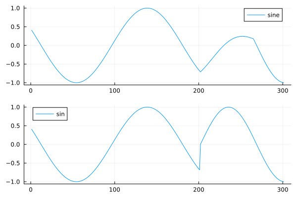
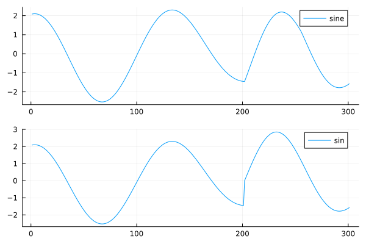
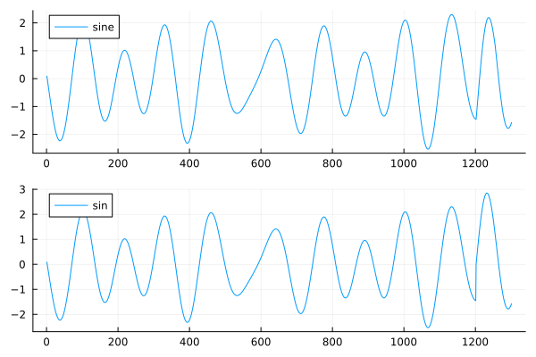
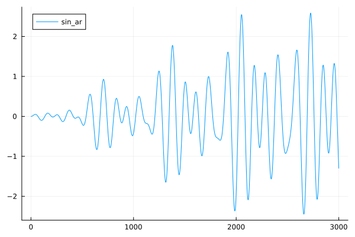
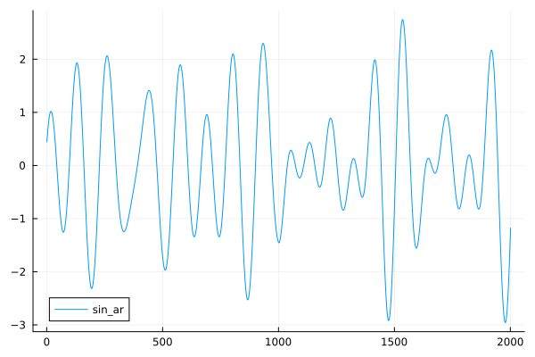
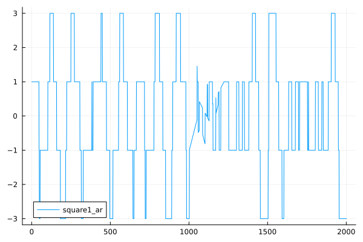
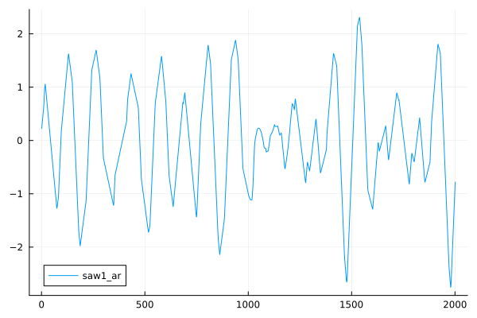

```@meta
CurrentModule = MusicalPlaying
```

# Sounds

A sound is a function and a duration it sould be played.
When playing a sound, the function is sampled to generate a sound of the required length.

We can get a sound, from a note through this path:

* Note + Tuning -> Tone
* Tone + Instrument -> Sound

So the Note encodes the abstract musical information about pich, duration and loudness.
The Tuning turns this into frequency.
The instrument describes how to actually render the tone: it is a function takin a tone (including duration), tempo (bpm) and a starting time, and returns a function that can be sampled over the time interval

The simples instrument is just a sine function, but with an envelope extending the playing to it reaches 0.

That instrument is caled `sine`.

``` julia
using MusicalPlaying
n1 = note("C")
t1 = tone(n1, tuning = tet12)
s1 = sound(t1, sine)
play_wav(s1)
```

Playing a short melody:

``` julia
using MusicalPlaying
m2 = Melody([note("C"), note("E"), note("G")])
s2 = sound(m2, sine)
play_wav(s2)
```

How does the samples look?

``` julia
using MusicalPlaying
n1 = note("A")
t1 = tone(n1, tuning = tet12)
s1 = sound(t1, sine)
s2 = MusicalPlaying.sample(s1)
plot(s2[1:100])
plot(s2[end-100:end])
length(s2) # 44201
s1.seconds # 1.0022727
```

I we use the simple `sin()` function it would not end at zero, but it respects the 1s tone length.

``` julia
julia> plot(plot(MusicalPlaying.sample_wav_direct(note("C"))[43900:end]), plot(MusicalPlaying.sample(sound(tone(note("C")),sine))[43900:end]), link=:both, layout=(2,1), label=["sin" "sine"])
```


We can hear that we do not get the "click" between the tones when comparing:

``` julia
using MusicalPlaying
m2 = Melody([note("C"), note("E"), note("G")])
s2 = sound(m2, sine)
play_wav(s2)
```

to 

``` julia

using MusicalPlaying
play_wav_direct(note.(["C", "E", "G"]))
```

We can also see it: the simple `sin` function is discontinuous at the change between the tones (index 200).

``` julia
using MusicalPlaying
s1 = MusicalPlaying.sample(sound(Melody([note("C"), note("E"), note("G")]),sine))
s2 = vcat(MusicalPlaying.sample_wav_direct(Melody(note.(["C", "E", "G"])))...)
length(s1) # 132_301
length(s2) # 132_300
julia> plot(plot(s1[43900:44200]), plot(s2[43900:44200]), link=:both, layout=(2,1))
```



We could improve the `sine` by delaying the onset of the next tone, to the first has ended.

This gets complicated. 
A simpler solution is to use an [ADSR envelope](https://en.wikipedia.org/wiki/Envelope_(music)#ADSR).

# Sound functions

We delay the sampling of the functions as much as possible.

The sound functions generated from the tones are multipleid by the envelope to only sound in the time interval specified.

# Chords

``` julia
using MusicalPlaying
c1 = chord(["C", "E", "G"])
c2 = chord(["F", "A", "C"])
c3 = chord(["G", "B", "D"])
m3 = Melody([c1, c2, c3, c1])
s3 = sound(m3, sine)
play_wav(s3)
```

It is a bit better than not much better than

``` julia
m4 = Melody([chord(["C", "E", "G"]), chord(["F","A","C"]), chord(["G", "B", "D"]), chord(["C", "E", "G"])])
play_wav_direct(m4)
```

Plotting:

``` julia
range = 43900:44200
p1 = plot(MusicalPlaying.sample(s3)[range])
p2 = plot(vcat(MusicalPlaying.sample_wav_direct(m4)...)[range])
plot(p1, p2, link=:both, layout=(2,1), label = ["sine" "sin"])
```



Taking a bit more context the difference is small (it is at index 1200):

``` julia
range = 42900:44200
p1 = plot(MusicalPlaying.sample(s3)[range])
p2 = plot(vcat(MusicalPlaying.sample_wav_direct(m4)...)[range])
plot(p1, p2, link=:both, layout=(2,1), label = ["sine" "sin"])
```



# Using an envelope

The function `_sin_ar` is a generator function that can generate sine functions with attack and release envelope.
Using just 5 ms attack and release is enough

``` julia
using MusicalPlaying
sinear = MusicalPlaying.Instrument(((t,b,s) -> MusicalPlaying._sine_ar(t,b,s, attack=0.005, release = 0.005)))
c1 = chord(["C", "E", "G"])
c2 = chord(["F", "A", "C"])
c3 = chord(["G", "B", "D"])
m3 = Melody([c1, c2, c3, c1])
s3 = sound(m3, sinear)
play_wav(s3)
```

This give a nice smooth transition, but also makes the notes fall a little bit (50 ms) behind.

The 50 ms is 44100*0.005 = 220 samples, so let's look at the first 3000 samples:

``` julia
julia> plot(MusicalPlaying.sample(s3)[1:1000], label = "sin_ar")
```



We can also look at the change of chords:

``` julia
range = (-1000:1000) .+ 44100
plot(MusicalPlaying.sample(s3)[range], label = "sin_ar")
```

We export that with the name `sine_ar`.

``` julia
using MusicalPlaying
c1 = chord(["C", "E", "G"])
c2 = chord(["F", "A", "C"])
c3 = chord(["G", "B", "D"])
m3 = Melody([c1, c2, c3, c1])
s4 = sound(m3, sine_ar)
play_wav(s4)
range = (-1000:1000) .+ 44100
plot(MusicalPlaying.sample(s4)[range], label = "sin_ar")
```

The transition is at index 1000.



# Other oscillators

## Square ocillator

``` julia
using MusicalPlaying
c1 = chord(["C", "E", "G"])
c2 = chord(["F", "A", "C"])
c3 = chord(["G", "B", "D"])
m3 = Melody([c1, c2, c3, c1])
s5 = sound(m3, MusicalPlaying.square1_ar)
play_wav(s5)
range = (-1000:1000) .+ 44100
plot(MusicalPlaying.sample(s5)[range], label = "square1_ar")
```




## Saw ocillator

``` julia
using MusicalPlaying
c1 = chord(["C", "E", "G"])
c2 = chord(["F", "A", "C"])
c3 = chord(["G", "B", "D"])
m3 = Melody([c1, c2, c3, c1])
s6 = sound(m3, MusicalPlaying.saw1_ar)
play_wav(s6)
range = (-1000:1000) .+ 44100
plot(MusicalPlaying.sample(s6)[range], label = "saw1_ar")
```



## The oscillators


